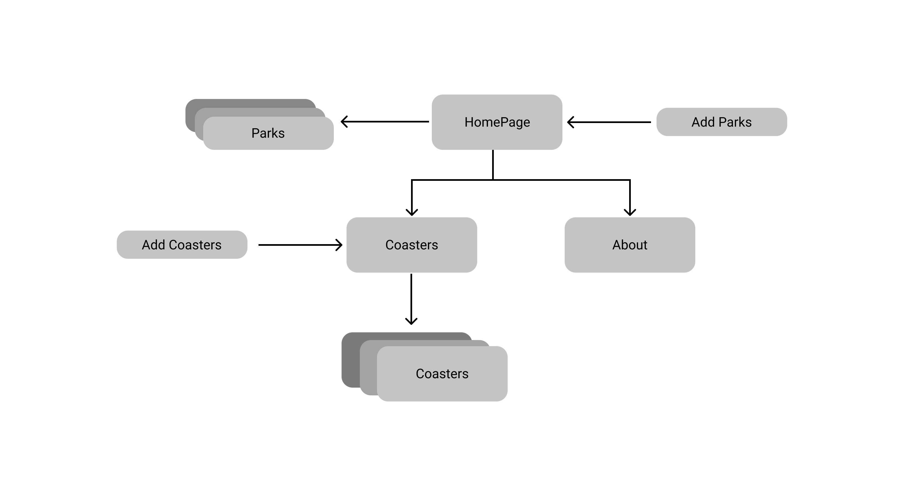
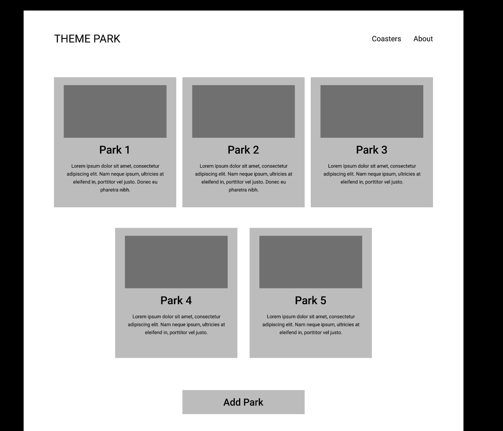
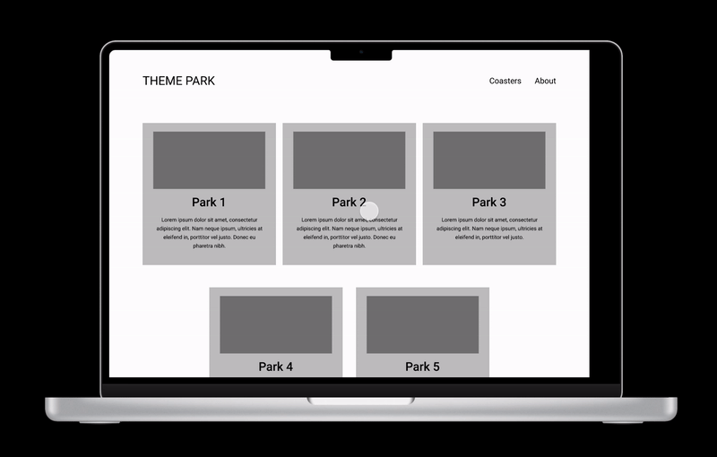

# **Rollercoster Park-Ride-front-end**

## Group Proect - Team ASSY
###### Date: March 23rd, 2022
#### GitHub Boss: Alex
#### BackEnd Masters: Alex, Shubro
#### FrontEnd Masters: Steve, Yusong
***

## Summary
For this group project, we are building a full-stack app with a database of fun, exciting rollercoasters located in different theme parks in America. 
***

## Back-End
Parks and rollercoasters will be in the different collections and contain names, a short paragraph of descriptions, and some other fun facts.
***

## Front-End

After discussion, we decided to feature 5 different theme parks on the landing page with an 'add more' call to action button to let more parks able to add to our database later by our users. Once you clicked the featured parks, you'll be able to see which rollercoaster is in the theme park. With some introduction to the rollercoaster and some fun facts we listed, you will find your next vacation destination in no time!

We will have header/nav components displayed on all of the pages with links to different subpages. And each theme park featured on the home page will be a component as well, clicking into the park will retrieve information from the database we created. After you navigate to the detailed page, you'll find a comment section with like buttons add to it as well.

## Plan
***
As listed above, we will be working in small groups. We will try to make things separately and use what we learned so far to build our project.

### Wireframes 
Please click for for the [Prototype](https://www.figma.com/proto/OT4hQpAppAblP6o8tUicgn/Untitled?page-id=0%3A1&node-id=29%3A541&viewport=383%2C48%2C0.29&scaling=scale-down&starting-point-node-id=29%3A363)